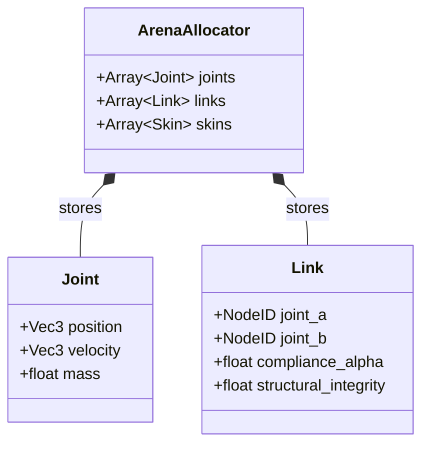
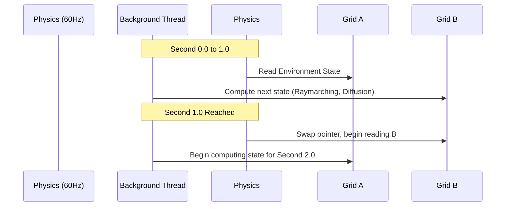

# The Volumetric JLSM Engine: System Architecture

This document defines the core technical implementations of the JLSM Engine, outlining how the system handles the strict boundary between physics calculation, UI rendering, and thermodynamic simulation.

## 1. System Overview & Data Flow

The engine is split across a strict boundary: Rust handles all state and mutation (`core_pbd`), while Python/ModernGL handles all visualization (`fishtank_ui`). To ensure high-performance execution (60Hz Criterion), **object serialization is strictly forbidden**.

Data is passed via **Zero-Copy Memory Buffers**. Rust writes to flat, contiguous arrays in memory. Python reads these memory views and binds them directly to GPU Vertex Buffer Objects (VBOs) via ModernGL.

```mermaid
graph TD
    subgraph core_pbd [Rust: core_pbd (Mutation Layer)]
        PBD[Position Based Dynamics Solver]
        Thermo[1Hz Thermodynamic Grids]
        Cog[Cognitive Matrix]
        State[(Flat Memory Arrays / ECS)]

        PBD --> State
        Thermo --> State
        Cog --> State
    end

    subgraph MemoryBoundary [PyO3 / FFI Boundary]
        ZeroCopy[Zero-Copy Numpy Memory Views]
    end

    subgraph fishtank_ui [Python: fishtank_ui (Presentation Layer)]
        GL[ModernGL / Pygame]
        Shaders[Compute / Vertex Shaders]
    end

    State --> ZeroCopy
    ZeroCopy -->|Raw Vertex Data| GL
    GL --> Shaders
```

## 2. JLSM Graph (Somatic Morphology)

Directed/undirected graphs with cyclic references (like the Joint-Link-Skin-Muscle graph) are difficult to implement in Rust using native pointers due to the borrow checker. Furthermore, pointer chasing ruins CPU cache locality.

We utilize a **Data-Oriented ECS / Arena Allocator** pattern.
Entities are defined by components stored in contiguous arrays. Joints, Links, and Skins reference each other via `NodeID` indices, not memory addresses.



## 3. The Thermodynamic Grids & Double Buffering

The 1Hz grids (Illumination, Temperature, Oxygen, Fluid) represent massive 3D scalar/vector fields. Updating these on the main thread every 60 frames would cause massive lag spikes, failing the 60Hz Criterion. Slicing the update across frames causes "Causality Shearing."

**Solution: Double Buffering.**
We maintain two grids. The physics engine reads from `Grid A` while a background thread computes `Grid B`. Once a second has passed, the pointers swap.



## 4. Cognitive Spatial Routing

When entities mutate, new inputs (sensors) and outputs (muscles) must map to the nearest physical hidden neuron in 3D space. To avoid $O(N^2)$ distance calculations during birth/mutation, the cognitive block utilizes spatial partitioning.

During initialization, hidden neurons are placed into a **KD-Tree or Spatial Hash Grid**. Resolving the mapping of a newly mutated sensor simply requires an $O(1)$ or $O(\log N)$ nearest-neighbor query.
